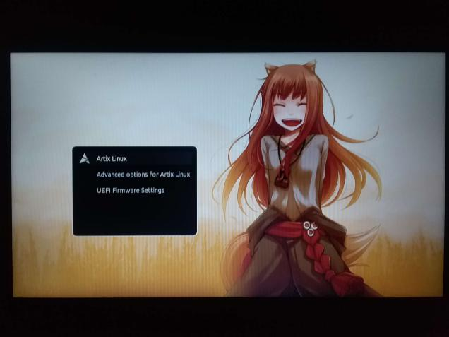

<!-- PROJECT LOGO -->
 

  

  <h3 align="center">Holo Grub Theme</h3>

  

    Forked from <a href="https://github.com/SPAWNRYS-ban/mahiro-grub">
      mahiro-grub
    </a>
     
     
     
  

<!-- ABOUT THE PROJECT -->
## About The Project
I liked the Holo image more than the Mahiro one, personally.
I tend to lose GRUB themes after installs, so I'm opting to just upload my
personal theme here to have a bit of extra insurance that I don't lose it again.
See `original.png` for the unedited image.

## Installation methods
1. [youtube.com/watch?v=gVuoxxv0VfA](https://www.youtube.com/watch?v=gVuoxxv0VfA) CMD
2. [youtube.com/watch?v=V7NUnI9nerA](https://www.youtube.com/watch?v=V7NUnI9nerA) Ventoy
3. Grub Customizer (This is the method I use personally and it is quite simple)
